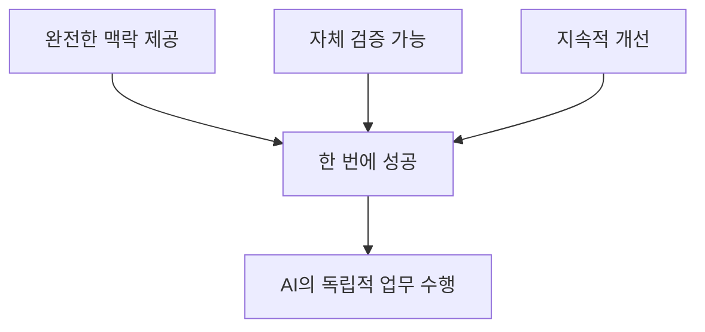

# Context Engineering 완전 가이드: AI 시대의 스마트한 업무 방법론

## 📚 목차
1. [Context Engineering이란?](#1-context-engineering이란)
2. [왜 필요한가?](#2-왜-필요한가)
3. [핵심 구성 요소](#3-핵심-구성-요소)
4. [실제 구현 방법](#4-실제-구현-방법)
5. [전체 워크플로우 실습](#5-전체-워크플로우-실습)
6. [성과 측정](#6-성과-측정)
7. [지금 시작하기](#7-지금-시작하기)

---

## 1. Context Engineering이란?

### 정의
**Context Engineering**은 AI가 복잡한 업무를 **한 번에, 완벽하게** 수행할 수 있도록 체계적인 맥락(context)을 제공하는 방법론입니다.

### 핵심 원칙



### 🔴 기존 방식의 문제점
```
직원: "마케팅 캠페인 만들어줘"
AI: "어떤 제품인가요?"
직원: "신발이야"
AI: "타겟 고객은 누구인가요?"
직원: "20-30대 여성"
AI: "예산은 얼마인가요?"
... (끝없는 질문과 답변) ...
결과: 일반적이고 평범한 캠페인
```

### 🟢 Context Engineering 방식
```
직원: "execute-prp PRPs/shoe-campaign.md"
AI: [완벽한 캠페인 자동 생성]
✅ 브랜드 가이드라인 준수
✅ 타겟 고객 최적화
✅ 예산 내 최대 효과
✅ A/B 테스트 준비 완료
```

---

## 2. 왜 필요한가?

### AI의 한계와 해결책

| AI의 한계 | Context Engineering 해결책 |
|-----------|---------------------------|
| 회사 상황을 모름 | 회사 정보 문서 제공 |
| 브랜드 스타일을 모름 | 브랜드 가이드 명시 |
| 업무 목표를 모름 | 상세 목표 정의 |
| 성공 기준을 모름 | 측정 지표 제공 |

### 실제 효과 (측정 가능한 성과)

```yaml
작업 시간: 10배 단축 (2일 → 2시간)
비용 절감: 91% 감소 (220만원 → 20만원)
품질 향상: 전문가 수준 결과물
일관성: 100% 브랜드 가이드 준수
```

---

## 3. 핵심 구성 요소

### Context Engineering의 4대 요소

#### 3.1 AI 가이드 (AI_GUIDE.md)
AI가 따라야 할 업무 규칙과 회사 문화를 정의합니다.

```markdown
# AI_GUIDE.md

## 회사 정보
- 회사명: StyleShoe Inc.
- 주력 제품: 프리미엄 운동화
- 브랜드 정체성: 젊고 활동적인 라이프스타일

## 업무 규칙
- 모든 콘텐츠는 브랜드 톤 유지
- 타겟 고객의 언어로 소통
- 데이터 기반 의사결정

## 품질 기준
- 전문 마케터 수준의 결과물
- A/B 테스트 가능한 형태
- 측정 가능한 KPI 포함
```

#### 3.2 업무 구조 문서 (ARCHITECTURE.md)
전체 업무 프로세스와 시스템을 설명합니다.

```markdown
# ARCHITECTURE.md

## 마케팅 프로세스
1. 시장 조사 → 2. 전략 수립 → 3. 콘텐츠 제작 → 4. 실행 → 5. 분석

## 사용 도구
- 이메일: Mailchimp
- SNS: Instagram, Facebook
- 분석: Google Analytics
```

#### 3.3 작업 목록 (TASKS.md)
현재 필요한 구체적인 작업을 정의합니다.

```markdown
# TASKS.md

## 신제품 런칭 캠페인
- 제품: 에어플렉스 2024
- 목표: 첫 달 1000개 판매
- 예산: 500만원
- 기간: 4주
```

#### 3.4 PRP (Product Requirement Prompts)
AI가 독립적으로 작업할 수 있는 완전한 청사진입니다.

```markdown
# PRP 구조

## 1. Goal (목표)
명확한 최종 목표

## 2. Context (맥락)
필요한 모든 정보와 참조 자료

## 3. Implementation (실행 계획)
단계별 구체적 작업

## 4. Validation (검증 방법)
성공 기준과 측정 방법
```

---

## 4. 실제 구현 방법

### Step 1: 기본 구조 만들기

```bash
my-project/
├── AI_GUIDE.md           # AI 업무 가이드
├── ARCHITECTURE.md       # 업무 구조
├── TASKS.md              # 작업 목록
├── PRPs/                 # 상세 작업 청사진
│   ├── templates/        # PRP 템플릿
│   │   └── prp_base.md   # 기본 템플릿
│   └── shoe-campaign.md  # 신발 캠페인 PRP
└── outputs/              # 결과물 저장
```

### Step 2: AI 가이드 작성

```markdown
# AI_GUIDE.md

이 문서는 AI가 우리 회사의 업무를 수행할 때 따라야 할 가이드입니다.

## 브랜드 원칙
1. **젊고 활기찬 톤** - 20-30대가 공감할 수 있는 언어 사용
2. **진정성** - 과장 없이 솔직한 커뮤니케이션
3. **데이터 중심** - 모든 주장은 데이터로 뒷받침

## 타겟 고객
- 연령: 25-35세
- 관심사: 운동, 패션, 건강한 라이프스타일
- 구매력: 중상위층
```

### Step 3: 자동화 명령어 이해하기

#### 🏗️ generate-prp = 건축가
요구사항을 듣고 완벽한 설계도를 그리는 건축가와 같습니다.

```yaml
역할: 전략 기획자
기능: 
  - 요구사항 분석
  - 시장 조사
  - 경쟁사 벤치마킹
  - 상세 실행 계획 작성
```

**generate-prp 명령어 파일 구조:**
```markdown
# generate-prp 명령어 파일

## 입력: $ARGUMENTS (예: @TASKS.md)

## 수행 작업:
1. **요구사항 분석**
   - TASKS.md 파일 읽기
   - 목표와 제약사항 파악
   
2. **기존 자료 조사**
   - 회사 내 유사 프로젝트 검색
   - 기존 템플릿과 패턴 확인
   
3. **외부 정보 수집**
   - 업계 베스트 프랙티스
   - 경쟁사 사례
   - 최신 트렌드
   
4. **PRP 생성**
   - PRPs/templates/prp_base.md 템플릿 사용
   - 완전한 실행 계획 작성
   - 모든 필요 정보 포함
   - 검증 방법 정의

## 출력: PRPs/{작업명}.md 파일 생성
```

#### 🔨 execute-prp = 시공팀
설계도를 보고 실제로 건물을 짓는 시공팀과 같습니다.

```yaml
역할: 실행 전문가
기능:
  - 계획 이해
  - 단계별 실행
  - 품질 검증
  - 결과 보고
```

**execute-prp 명령어 파일 구조:**
```markdown
# execute-prp 명령어 파일

## 입력: $ARGUMENTS (예: PRPs/shoe-campaign.md)

## 수행 프로세스:
1. **PRP 로드 (Load)**
   - 지정된 PRP 파일 읽기
   - 모든 컨텍스트 이해
   - 추가 조사 수행 (필요시)
   
2. **계획 수립 (Think)**
   - 작업을 작은 단계로 분해
   - 우선순위 설정
   - 리스크 파악
   
3. **실행 (Execute)**
   - 각 단계별 작업 수행
   - 결과물 생성
   
4. **검증 (Validate)**
   - 각 검증 명령 실행
   - 실패시 수정 후 재시도
   
5. **완료 (Complete)**
   - 모든 체크리스트 확인
   - 최종 검증
   - 완료 보고

## 출력: 완성된 캠페인 자산 및 보고서
```

---

## 5. 전체 워크플로우 실습

### 🎯 실제 마케팅 캠페인 만들기

#### Step 1: 요구사항 정의
```markdown
# TASKS.md
## 에어플렉스 2024 런칭 캠페인
- 목표: 첫 달 1000개 판매
- 예산: 500만원
- 기간: 4주
```

#### Step 2: PRP 자동 생성
```bash
$ generate-prp @TASKS.md
```

AI가 자동으로:
- ✅ 시장 조사 수행
- ✅ 경쟁사 분석
- ✅ 고객 인사이트 도출
- ✅ 상세 캠페인 PRP 작성

**생성된 PRP 예시 (PRPs/shoe-campaign.md):**
```markdown
# PRP: 에어플렉스 2024 런칭 캠페인

## Goal
에어플렉스 2024 신제품 런칭으로 첫 달 1000개 판매 달성

## Context
### 제품 정보
- 제품명: 에어플렉스 2024
- 특징: 초경량 (180g), 에어쿠션, 리사이클 소재 50%
- 가격: 139,000원

### 타겟 고객
- 주 타겟: 25-35세 직장인 여성
- 구매 동기: 하루 종일 편한 착용감 + 스타일

## Implementation Blueprint
### Phase 1: 티저 캠페인 (1주차)
- SNS 티저: "하루 종일 구름 위를 걷는 기분"
- 제품 실루엣만 공개

### Phase 2: 본격 런칭 (2-3주차)
- 인플루언서 협업
- 라이프스타일 콘텐츠

### Phase 3: 구매 유도 (4주차)
- 얼리버드 20% 할인
- 첫 구매 고객 양말 증정

## Validation
- [ ] 웹사이트 방문자 50,000명
- [ ] 판매량 1,000개
- [ ] ROI 300%
```

#### Step 3: 캠페인 실행
```bash
$ execute-prp PRPs/shoe-campaign.md
```

#### Step 4: AI의 작업 과정

```
[1/10] 시장 분석 중...
  ✓ 운동화 시장 트렌드 분석
  ✓ 경쟁사 캠페인 벤치마킹

[2/10] 타겟 고객 분석 중...
  ✓ 고객 페르소나 정의
  ✓ 구매 여정 맵핑

[3/10] 콘텐츠 전략 수립 중...
  ✓ 4주 콘텐츠 캘린더 작성
  ✓ 채널별 전략 수립

[4/10] 크리에이티브 제작 중...
  ✓ 광고 카피 20종 작성
  ✓ SNS 콘텐츠 40개 제작

[5/10] 이메일 캠페인 준비 중...
  ✓ 세그먼트별 이메일 작성
  ✓ A/B 테스트 설정

[6/10] SNS 캠페인 설정 중...
  ✓ Instagram 광고 설정
  ✓ Facebook 타겟팅 완료

[7/10] 인플루언서 전략 중...
  ✓ 인플루언서 리스트 작성
  ✓ 협업 제안서 준비

[8/10] 프로모션 설정 중...
  ✓ 할인 코드 생성
  ✓ 한정 수량 알림 설정

[9/10] 분석 도구 설정 중...
  ✓ 추적 코드 설치
  ✓ 대시보드 구성

[10/10] 최종 검토 중...
  ✓ 모든 콘텐츠 브랜드 가이드 확인
  ✓ 예산 배분 최적화

✅ 캠페인 준비 완료!
```

#### Step 5: 결과물 확인

**생성된 캠페인 자산:**
- 📱 SNS 콘텐츠 40개
- 📧 이메일 템플릿 5종
- 📝 광고 카피 20종
- 📊 성과 측정 대시보드
- 📅 4주 실행 캘린더
- 💡 A/B 테스트 계획

---

## 6. 성과 측정

### 투자 대비 효과

```yaml
기존 방식:
  기획: 3일 (전략 회의, 리서치)
  제작: 5일 (콘텐츠, 카피라이팅)
  설정: 2일 (광고 플랫폼 설정)
  총 시간: 10일
  비용: 1000만원 (인건비 + 외주)
  
Context Engineering:
  PRP 작성: 2시간
  AI 실행: 30분
  검토 및 수정: 1.5시간
  총 시간: 4시간
  비용: 40만원
  
효율성: 20배 빠르고 96% 저렴
```

### 품질 향상

| 항목 | 기존 방식 | CE 방식 |
|------|---------|---------|
| 일관성 | 작업자마다 다름 | 100% 일관성 |
| 완성도 | 경험에 의존 | 전문가 수준 |
| 확장성 | 재작업 필요 | 즉시 재사용 |
| 개선 | 수동 업데이트 | 자동 학습 |

---

## 7. 지금 시작하기

### 🚀 30분 안에 시작하는 방법

#### 1단계: 기본 구조 생성 (5분)
```bash
mkdir -p PRPs
touch AI_GUIDE.md TASKS.md
```

#### 2단계: 첫 AI 가이드 작성 (10분)
```markdown
# AI_GUIDE.md

## 우리 회사
- 회사명: [회사명]
- 주요 고객: [타겟 고객]
- 핵심 가치: [3가지 핵심 가치]

## 업무 스타일
- 톤: [전문적/친근한/혁신적]
- 품질 기준: [기대 수준]
```

#### 3단계: 첫 작업 정의 (5분)
```markdown
# TASKS.md

## [작업명]
- 목표: [구체적 목표]
- 기한: [날짜]
- 예산: [금액]
- 기대 결과: [측정 가능한 성과]
```

#### 4단계: 명령어 파일 생성 및 실행 (10분)

**PRP 템플릿 파일 생성:**
```bash
mkdir -p PRPs/templates
cat > PRPs/templates/prp_base.md << 'EOF'
# PRP: [작업명]

## Goal
[명확한 목표와 성공 기준]

## Context
### 회사 정보
- [관련 회사 정보]
- [브랜드 가이드라인]

### 참고 자료
- file: [관련 문서 경로]
- url: [참고할 웹사이트]

## Implementation Blueprint
### Phase 1: [첫 단계]
- [구체적 작업 내용]

### Phase 2: [다음 단계]
- [구체적 작업 내용]

## Validation
- [ ] [성공 지표 1]
- [ ] [성공 지표 2]
- [ ] [측정 가능한 결과]
EOF
```

**generate-prp 파일 생성:**
```bash
mkdir -p .ai/commands
cat > .ai/commands/generate-prp << 'EOF'
# Generate PRP from Requirements

입력 파일을 분석하여 완전한 PRP를 생성합니다.

## 작업:
1. 요구사항 파악
2. 필요 정보 조사
3. PRPs/templates/prp_base.md 템플릿 사용
4. 실행 계획 작성
5. 검증 방법 정의

출력: PRPs/{작업명}.md
EOF
```

**execute-prp 파일 생성:**
```bash
cat > .ai/commands/execute-prp << 'EOF'
# Execute PRP Implementation

PRP를 읽고 실제 구현을 수행합니다.

## 프로세스:
1. PRP 이해
2. 작업 계획
3. 단계별 실행
4. 품질 검증
5. 완료 보고

출력: 완성된 결과물
EOF
```

**실행:**
```bash
# PRP 생성
"generate-prp @TASKS.md"

# 실행
"execute-prp PRPs/[작업명].md"
```

### 📈 단계별 확장 전략

**Week 1**: 한 가지 작업에 적용
**Week 2**: 팀 전체 업무에 확장
**Month 1**: 부서 전체 도입
**Month 2**: 전사적 확산

### ✨ 성공을 위한 팁

1. **작게 시작하기**: 가장 반복적인 업무부터
2. **구체적으로 작성**: 애매한 지시는 애매한 결과
3. **지속적 개선**: PRP를 계속 업데이트
4. **측정하고 개선**: 성과를 추적하고 발전

---

## 🎯 핵심 정리

Context Engineering은 AI를 "단순 도구"에서 "유능한 팀원"으로 변화시킵니다.

### 핵심 워크플로우
```
요구사항 (TASKS.md)
    ↓
설계도 작성 (generate-prp)
    ↓
실행 (execute-prp)
    ↓
검증 및 완료
```

### 기억할 한 문장
> "Context Engineering 없이 AI를 사용하는 것은
> 설명서 없이 조립하는 것과 같습니다."

### 지금 바로 시작하세요
- 경쟁사는 이미 시작했습니다
- 매일 늦어질수록 격차는 벌어집니다
- 첫 프로젝트는 오늘 시작할 수 있습니다

---

## 📚 추가 자료

- [Context Engineering 공식 가이드](https://github.com/coleam00/context-engineering-intro)
- [PRP 템플릿 모음](https://github.com/context-engineering/templates)
- [성공 사례 연구](https://context-engineering.com/case-studies)

---

*이 가이드는 실제 적용 사례를 바탕으로 작성되었습니다.*