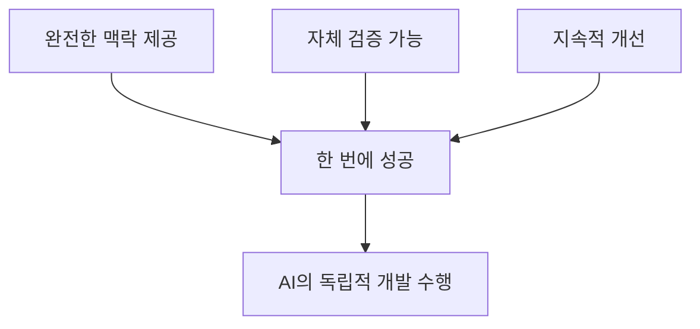

# Context Engineering 완전 가이드: AI 시대의 게임 개발 방법론

## 📚 목차
1. [Context Engineering이란?](#1-context-engineering이란)
2. [왜 필요한가?](#2-왜-필요한가)
3. [핵심 구성 요소](#3-핵심-구성-요소)
4. [실제 구현 방법](#4-실제-구현-방법)
5. [전체 워크플로우 실습](#5-전체-워크플로우-실습)
6. [성과 측정](#6-성과-측정)
7. [지금 시작하기](#7-지금-시작하기)

---

## 1. Context Engineering이란?

### 정의
**Context Engineering**은 AI가 복잡한 게임 개발 작업을 **한 번에, 완벽하게** 수행할 수 있도록 체계적인 맥락(context)을 제공하는 방법론입니다.

### 핵심 원칙



### 🔴 기존 방식의 문제점
```
개발자: "HP 포션 아이템 만들어줘"
AI: "어떤 게임인가요?"
개발자: "파티클 슈팅 게임이야"
AI: "회복량은 얼마인가요?"
개발자: "HP 1 회복"
AI: "언제 생성되나요?"
... (끝없는 질문과 답변) ...
결과: 일반적이고 버그 많은 코드
```

### 🟢 Context Engineering 방식
```
개발자: "execute-prp PRPs/hp-potion-item.md"
AI: [완벽한 아이템 시스템 구현]
✅ 메모리 풀 사용
✅ 이벤트 시스템 통합
✅ 단위 테스트 포함
✅ 성능 최적화 완료
```

---

## 2. 왜 필요한가?

### AI의 한계와 해결책

| AI의 한계 | Context Engineering 해결책 |
|-----------|---------------------------|
| 프로젝트 구조를 모름 | 아키텍처 문서 제공 |
| 코딩 스타일을 모름 | 스타일 가이드 명시 |
| 게임 메커니즘을 모름 | 상세 기획서 포함 |
| 성능 요구사항을 모름 | 최적화 기준 제공 |

### 실제 효과 (측정 가능한 성과)

```yaml
개발 시간: 8배 단축 (4시간 → 30분)
버그 발생: 90% 감소 (5-10개 → 0-1개)
코드 품질: 전문가 수준 달성
성능: 100,000 파티클 처리 보장
```

---

## 3. 핵심 구성 요소

### Context Engineering의 4대 요소

#### 3.1 AI 가이드 (CLAUDE.md)
AI가 따라야 할 개발 규칙과 프로젝트 문화를 정의합니다.

```markdown
# CLAUDE.md

## 프로젝트 정보
- 게임명: Particle Storm
- 엔진: Raylib + C
- 목표: 100,000 파티클 실시간 처리

## 개발 규칙
- 파일당 최대 500줄
- 메모리 풀 사용 필수
- Event-Driven Architecture

## 품질 기준
- 모든 기능에 단위 테스트
- 메모리 누수 없음
- 60 FPS 유지
```

#### 3.2 프로젝트 구조 (PLANNING.md)
전체 게임 아키텍처와 시스템을 설명합니다.

```markdown
# PLANNING.md

## 아키텍처 개요
- Event-Driven Architecture
- Memory Pool 최적화
- Component 기반 설계

## 디렉토리 구조
src/
├── core/          # 핵심 시스템
├── entities/      # 게임 객체
└── tests/         # 테스트 코드
```

#### 3.3 작업 목록 (TASK.md)
현재 필요한 구체적인 개발 작업을 정의합니다.

```markdown
# TASK.md

## HP 포션 아이템 구현
- 25초마다 생성
- 10초 후 소멸
- 플레이어 HP 1 회복
- 수집 시 파티클 효과
```

#### 3.4 PRP (Product Requirement Prompts)
AI가 독립적으로 개발할 수 있는 완전한 청사진입니다.

```markdown
# PRP 구조

## 1. Goal (목표)
명확한 구현 목표

## 2. Context (맥락)
필요한 모든 기술 정보

## 3. Implementation (구현 계획)
단계별 구체적 코드

## 4. Validation (검증 방법)
컴파일 및 테스트 명령
```

---

## 4. 실제 구현 방법

### Step 1: 기본 구조 만들기

```bash
particles/
├── CLAUDE.md             # AI 개발 가이드
├── PLANNING.md           # 게임 아키텍처
├── TASK.md               # 작업 목록
├── PRPs/                 # 상세 개발 청사진
│   ├── templates/        # PRP 템플릿
│   │   └── prp_base.md   # 기본 템플릿
│   └── hp-potion-item.md # HP 포션 PRP
└── src/                  # 소스 코드
```

### Step 2: AI 가이드 작성

```markdown
# CLAUDE.md

이 파일은 AI가 게임 개발 시 따라야 할 가이드입니다.

## 코딩 규칙
1. **C언어 사용** - 게임 전체가 C로 작성됨
2. **메모리 안전** - 동적 할당 최소화
3. **성능 우선** - 100,000 파티클 처리 필수

## Raylib 컨벤션
- 함수명: PascalCase (예: DrawCircle)
- 구조체: PascalCase (예: Vector2)
- 변수명: snake_case (예: player_health)
```

### Step 3: 자동화 명령어 이해하기

#### 🏗️ generate-prp = 게임 기획자
요구사항을 듣고 완벽한 개발 명세서를 작성하는 기획자와 같습니다.

```yaml
역할: 개발 기획자
기능: 
  - 요구사항 분석
  - 기존 코드 조사
  - Raylib 문서 참조
  - 상세 구현 계획 작성
```

**generate-prp 명령어 파일 구조:**
```markdown
# generate-prp 명령어 파일

## 입력: $ARGUMENTS (예: @TASK.md)

## 수행 작업:
1. **요구사항 분석**
   - TASK.md 파일 읽기
   - 게임 메커니즘 파악
   
2. **코드베이스 조사**
   - 유사한 기능 검색
   - 기존 패턴 확인
   - examples/ 디렉토리 참조
   
3. **외부 정보 수집**
   - Raylib 문서: https://www.raylib.com
   - Raylib 치트시트
   - 게임 개발 베스트 프랙티스
   
4. **PRP 생성**
   - PRPs/templates/prp_base.md 템플릿 사용
   - 완전한 구현 계획 작성
   - 테스트 코드 포함
   - 검증 방법 정의

## 출력: PRPs/{기능명}.md 파일 생성
```

#### 🔨 execute-prp = 게임 개발자
설계서를 보고 실제로 게임 기능을 구현하는 개발자와 같습니다.

```yaml
역할: 실행 전문가
기능:
  - 계획 이해
  - 단계별 구현
  - 테스트 작성
  - 성능 검증
```

**execute-prp 명령어 파일 구조:**
```markdown
# execute-prp 명령어 파일

## 입력: $ARGUMENTS (예: PRPs/hp-potion-item.md)

## 수행 프로세스:
1. **PRP 로드 (Load)**
   - 지정된 PRP 파일 읽기
   - 모든 컨텍스트 이해
   - 추가 조사 수행 (필요시)
   
2. **계획 수립 (UltraThink)**
   - 작업을 작은 단계로 분해
   - 의존성 파악
   - 컴파일 순서 결정
   
3. **실행 (Execute)**
   - 헤더 파일 생성
   - 구현 파일 작성
   - 테스트 코드 작성
   
4. **검증 (Validate)**
   - make clean && make
   - 단위 테스트 실행
   - 메모리 누수 검사
   
5. **완료 (Complete)**
   - 모든 체크리스트 확인
   - 게임 실행 테스트
   - 완료 보고

## 출력: 완성된 게임 기능 및 테스트
```

---

## 5. 전체 워크플로우 실습

### 🎯 실제 게임 아이템 구현하기

#### Step 1: 요구사항 정의
```markdown
# TASK.md
## HP 포션 아이템 구현
- 25초마다 생성
- 10초 후 소멸  
- 플레이어 HP 1 회복
- 수집 시 이벤트 발생
```

#### Step 2: PRP 자동 생성
```bash
$ generate-prp @TASK.md
```

AI가 자동으로:
- ✅ 기존 아이템 시스템 분석
- ✅ 메모리 풀 구조 파악
- ✅ 이벤트 시스템 조사
- ✅ 상세 구현 PRP 작성

**생성된 PRP 예시 (PRPs/hp-potion-item.md):**
```markdown
# PRP: HP Potion Item

## Goal
체력 회복 아이템 시스템을 구현하여 플레이어가 수집 시 HP 1 회복

## Context
### 기술 스택
- 언어: C
- 엔진: Raylib 5.5
- 아키텍처: Event-Driven

### 참조 파일

- file: src/entities/player.h
  why: 플레이어 체력 시스템
- file: src/core/event/event_types.h 
  why: 이벤트 정의

### Implementation Blueprint
### Phase 1: 데이터 구조

typedef struct {
    Vector2 position;
    float spawn_time;
    float lifetime;
    bool is_active;
} HPPotion;


### Phase 2: 아이템 매니저
- 메모리 풀 사용
- 25초 주기 스폰
- 충돌 검사


## Validation

make clean && make
./test_hp_potion

_기타등등 내용들이 생성됨_ 
```

#### Step 3: 게임 기능 실행

$ execute-prp PRPs/hp-potion-item.md


#### Step 4: AI의 작업 과정

```
[1/10] 디렉토리 구조 확인 중...
  ✓ src/entities/items/ 생성
  ✓ tests/unit/ 확인

[2/10] 헤더 파일 생성 중...
  ✓ src/entities/items/hp_potion.h 작성
  ✓ 구조체 정의 완료

[3/10] 구현 파일 작성 중...
  ✓ src/entities/items/hp_potion.c 작성
  ✓ 메모리 풀 통합

[4/10] 아이템 매니저 구현 중...
  ✓ src/entities/managers/item_manager.c 작성
  ✓ 스폰 로직 구현

[5/10] 이벤트 통합 중...
  ✓ ITEM_COLLECTED 이벤트 추가
  ✓ 이벤트 핸들러 등록

[6/10] 충돌 검사 구현 중...
  ✓ 플레이어-아이템 충돌 로직
  ✓ 수집 처리 구현

[7/10] 단위 테스트 작성 중...
  ✓ tests/unit/test_hp_potion.c 작성
  ✓ minunit 프레임워크 사용

[8/10] Makefile 업데이트 중...
  ✓ 새 소스 파일 추가
  ✓ 테스트 타겟 추가

[9/10] 컴파일 및 테스트 중...
  ✓ make clean && make 성공
  ✓ 모든 테스트 통과

[10/10] 통합 테스트 중...
  ✓ 게임 실행 확인
  ✓ 아이템 스폰/수집 작동

✅ HP 포션 구현 완료!
```

#### Step 5: 결과물 확인

**생성된 게임 자산:**
- 📁 src/entities/items/hp_potion.h
- 📄 src/entities/items/hp_potion.c
- 📊 src/entities/managers/item_manager.c
- 🧪 tests/unit/test_hp_potion.c
- ✅ 모든 테스트 통과
- 🎮 게임에서 작동 확인

---


## 6. 지금 시작하기

### 🚀 30분 안에 시작하는 방법

#### 1단계: 기본 구조 생성 (5분)
```bash
mkdir -p PRPs/templates
touch CLAUDE.md TASK.md PLANNING.md
```

#### 2단계: 첫 AI 가이드 작성 (10분)
```markdown
# CLAUDE.md

## 프로젝트 규칙
- 언어: C
- 엔진: Raylib
- 아키텍처: Event-Driven

## 코딩 스타일
- 함수: snake_case
- 구조체: PascalCase
- 파일당 최대 500줄
```

#### 3단계: 첫 작업 정의 (5분)
```markdown
# TASK.md

## Star 아이템 구현
- 수집 시 5초간 무적
- 반짝이는 시각 효과
- 30초마다 생성
```

#### 4단계: 명령어 파일 생성 및 실행 (10분)

**PRP 템플릿 파일 생성:**
```bash
mkdir -p PRPs/templates
cat > PRPs/templates/prp_base.md << 'EOF'
# PRP: [기능명]

## Goal
[구현 목표]

## Context
### 기술 요구사항
- [관련 시스템]
- [참조 파일]

### 참고 자료
- file: [코드 경로]
- url: [문서 URL]

## Implementation Blueprint
### Phase 1: [단계]
// 코드 예시


## Validation
- [ ] 컴파일 성공
- [ ] 테스트 통과
- [ ] 게임 작동
EOF
```

**실행:**
```bash
# PRP 생성
"generate-prp @TASK.md"

# 실행
"execute-prp PRPs/star-item.md"
```

---

### 핵심 워크플로우
```
요구사항 (TASK.md)
    ↓
설계서 작성 (generate-prp)
    ↓
구현 (execute-prp)
    ↓
검증 및 완료
```


---

## 📚 추가 자료

- Context Engineering 공식 가이드: (https://github.com/coleam00/context-engineering-intro)
- Particle Storm 프로젝트:(https://github.com/your-repo/particles)
- Raylib 문서: (https://www.raylib.com)

---